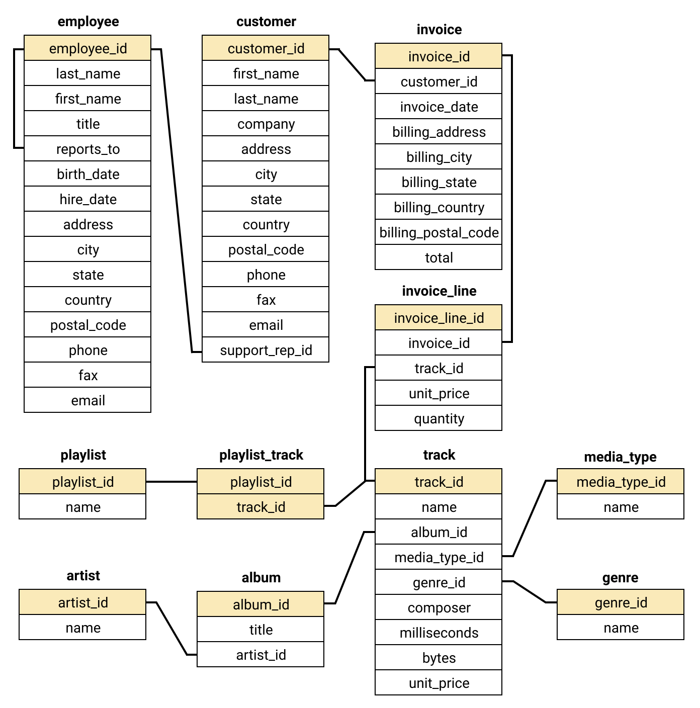

# Analyzing-Chinook-Database-using-SQL-and-Python
We'll be working with a modified version of a database called [Chinook](https://github.com/lerocha/chinook-database). The Chinook database contains information about a fictional digital music shop.

The Chinook database contains information about the artists, songs, and albums from the music shop, as well as information on the shop's employees, customers, and the customers purchases. This information is contained in eleven tables.

The Chinook database is provided as a SQLite database file called `chinook.db`. It's worth remembering that our database retains 'state', so if we run a query with a `CREATE` or `DROP` twice, the query will fail. If the database gets locked, there's a `chinook-unmodified.db` file that can be copied over the `chinook.db` to restore it back to its initial state.

Here's a schema diagram for the Chinook database:

## Getting Started

Download or View the Jupyter [notebook](https://github.com/arjunchndr/Analyzing-Chinook-Database-using-SQL-and-Python/blob/master/Analyzing%20Chinook%20Database%20using%20SQL%20and%20Python.ipynb) if you have all the dependencies listed below.

## Built With

* [Anaconda](https://www.anaconda.com/download/) - Distribution pre-installed with Python and its associated packages
  * [Python 3.6.3](https://www.python.org/downloads/) 
  * [Pandas](http://pandas.pydata.org/pandas-docs/stable/install.html) 
  * [Jupyter 5.1.0](http://jupyter.org/install.html)
  * [Matplotlib 2.1.1](https://matplotlib.org/users/installing.html#installing-an-official-release)
  * [Numpy 1.14.0](https://pypi.python.org/pypi/numpy)
  * [SQLite3](https://www.sqlite.org/download.html)
    * [How To Download & Install SQLite](http://www.sqlitetutorial.net/download-install-sqlite/)
